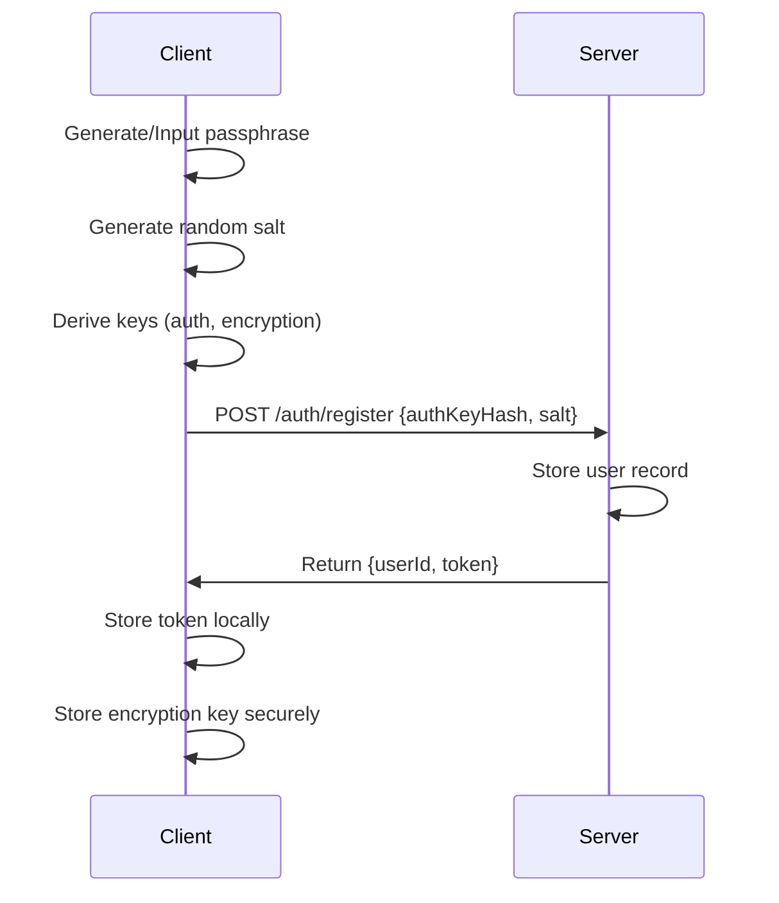
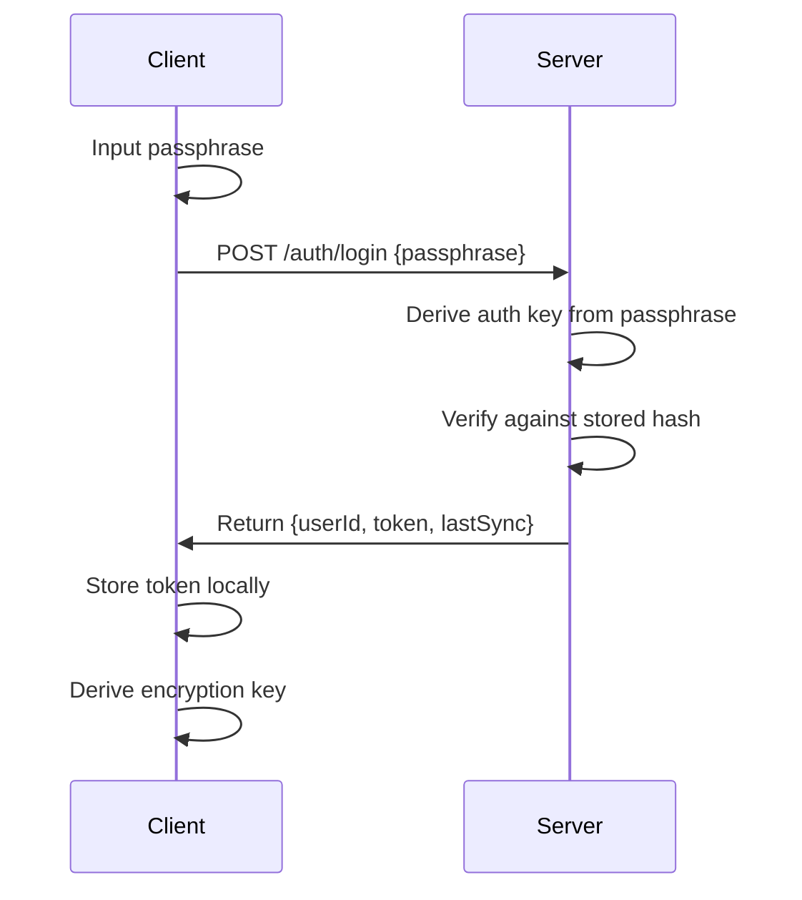

# DayWatch Security & Authentication - Detailed Specification

## Overview

This specification details the security architecture for DayWatch's passphrase-based authentication system, including encryption strategies, threat mitigation, and privacy protection measures.

## 1. Authentication Architecture

### 1.1 Passphrase-Based Identity System

**Core Principle**: Users are identified by their passphrase, not by traditional username/email combinations. This provides:
- **Privacy**: No personal information required
- **Portability**: Access from any device with just the passphrase
- **Simplicity**: Single credential to remember
- **Security**: Strong entropy when properly generated

### 1.2 Passphrase Requirements

```javascript
// Passphrase generation and validation
const PASSPHRASE_CONFIG = {
  // Use BIP39 wordlist for familiarity and standardization
  wordlist: 'bip39-english', // 2048 words
  minWords: 12,
  maxWords: 24,
  minEntropy: 128, // bits
  recommendedEntropy: 256, // bits
  
  // Validation rules
  allowCustomPhrases: true, // User can input their own
  requireMinimumEntropy: true,
  checkCommonPhrases: true // Reject dictionary phrases
};

// Entropy calculation
function calculateEntropy(wordCount, wordlistSize = 2048) {
  return Math.log2(Math.pow(wordlistSize, wordCount));
}

// Examples:
// 12 words = 128 bits entropy (minimum secure)
// 15 words = 160 bits entropy (recommended)
// 24 words = 256 bits entropy (maximum security)
```

### 1.3 Key Derivation Process

```javascript
// Multi-stage key derivation for security and functionality
class KeyDerivation {
  async deriveKeys(passphrase, userSalt) {
    // Stage 1: Master key derivation using Argon2id
    const masterKey = await this.deriveMasterKey(passphrase, userSalt);
    
    // Stage 2: Derive specific-purpose keys using HKDF
    const keys = await this.deriveSpecificKeys(masterKey, userSalt);
    
    return keys;
  }

  async deriveMasterKey(passphrase, salt) {
    // Use Argon2id for password hashing (memory-hard function)
    return await argon2id(passphrase, salt, {
      type: argon2.argon2id,
      memoryCost: 2 ** 16, // 64MB memory usage
      timeCost: 3,         // 3 iterations
      parallelism: 1,      // Single thread
      hashLength: 32       // 256-bit output
    });
  }

  async deriveSpecificKeys(masterKey, salt) {
    // Use HKDF to derive multiple keys from master key
    const authKey = await hkdf(masterKey, salt, 'DayWatch-Auth-v1', 32);
    const encryptionKey = await hkdf(masterKey, salt, 'DayWatch-Encrypt-v1', 32);
    const signingKey = await hkdf(masterKey, salt, 'DayWatch-Sign-v1', 32);
    
    return {
      authKey,      // For server authentication
      encryptionKey, // For data encryption
      signingKey    // For data integrity
    };
  }
}
```

## 2. Data Encryption Strategy

### 2.1 Client-Side Encryption

**Principle**: All sensitive data is encrypted on the client before transmission. The server never sees plaintext sensitive information.

```javascript
class DataEncryption {
  constructor(encryptionKey) {
    this.key = encryptionKey;
    this.algorithm = 'AES-256-GCM';
  }

  async encryptField(plaintext) {
    if (!plaintext) return { encrypted: null, iv: null, tag: null };
    
    // Generate random IV for each encryption
    const iv = crypto.getRandomValues(new Uint8Array(12)); // 96-bit IV for GCM
    
    // Import key for Web Crypto API
    const cryptoKey = await crypto.subtle.importKey(
      'raw',
      this.key,
      { name: 'AES-GCM' },
      false,
      ['encrypt']
    );
    
    // Encrypt with additional authenticated data
    const additionalData = new TextEncoder().encode('DayWatch-Data-v1');
    const encrypted = await crypto.subtle.encrypt(
      {
        name: 'AES-GCM',
        iv: iv,
        additionalData: additionalData
      },
      cryptoKey,
      new TextEncoder().encode(plaintext)
    );
    
    return {
      encrypted: this.arrayBufferToBase64(encrypted),
      iv: this.arrayBufferToBase64(iv),
      tag: null // GCM includes auth tag in ciphertext
    };
  }

  async decryptField(encryptedData) {
    if (!encryptedData.encrypted) return null;
    
    const cryptoKey = await crypto.subtle.importKey(
      'raw',
      this.key,
      { name: 'AES-GCM' },
      false,
      ['decrypt']
    );
    
    const additionalData = new TextEncoder().encode('DayWatch-Data-v1');
    const decrypted = await crypto.subtle.decrypt(
      {
        name: 'AES-GCM',
        iv: this.base64ToArrayBuffer(encryptedData.iv),
        additionalData: additionalData
      },
      cryptoKey,
      this.base64ToArrayBuffer(encryptedData.encrypted)
    );
    
    return new TextDecoder().decode(decrypted);
  }

  // Utility methods
  arrayBufferToBase64(buffer) {
    return btoa(String.fromCharCode(...new Uint8Array(buffer)));
  }

  base64ToArrayBuffer(base64) {
    const binary = atob(base64);
    const bytes = new Uint8Array(binary.length);
    for (let i = 0; i < binary.length; i++) {
      bytes[i] = binary.charCodeAt(i);
    }
    return bytes.buffer;
  }
}
```

### 2.2 Encrypted Data Schema

```javascript
// Timer data encryption mapping
const ENCRYPTED_FIELDS = {
  timer: {
    name: 'encrypted',        // Always encrypted
    location: 'encrypted',    // Always encrypted  
    link: 'encrypted',        // Always encrypted
    date: 'plaintext',        // Needed for server-side sorting
    color: 'plaintext',       // Not sensitive
    time: 'plaintext',        // Not sensitive
    showOnMainScreen: 'plaintext'
  },
  
  settings: {
    dateFormat: 'plaintext',
    displayFont: 'plaintext', 
    language: 'plaintext',
    hideTimers: 'plaintext'
  }
};

// Database storage format
const TIMER_STORAGE_FORMAT = {
  id: 'uuid',
  user_id: 'uuid',
  name_encrypted: 'base64_string',
  name_iv: 'base64_string',
  location_encrypted: 'base64_string',
  location_iv: 'base64_string', 
  link_encrypted: 'base64_string',
  link_iv: 'base64_string',
  date_timestamp: 'bigint',
  color: 'string',
  time_value: 'string',
  show_on_main_screen: 'boolean',
  version: 'integer',
  created_at: 'timestamp',
  updated_at: 'timestamp'
};
```

## 3. Authentication Flow

### 3.1 Registration Process



### 3.2 Login Process



### 3.3 Token Management

```javascript
class TokenManager {
  constructor() {
    this.tokenKey = 'daywatch_auth_token';
    this.refreshThreshold = 7 * 24 * 60 * 60 * 1000; // 7 days
  }

  storeToken(token) {
    const tokenData = {
      token,
      issuedAt: Date.now(),
      expiresAt: Date.now() + (30 * 24 * 60 * 60 * 1000) // 30 days
    };
    
    localStorage.setItem(this.tokenKey, JSON.stringify(tokenData));
  }

  getToken() {
    const stored = localStorage.getItem(this.tokenKey);
    if (!stored) return null;
    
    const tokenData = JSON.parse(stored);
    
    // Check if token is expired
    if (Date.now() > tokenData.expiresAt) {
      this.clearToken();
      return null;
    }
    
    return tokenData.token;
  }

  shouldRefresh() {
    const stored = localStorage.getItem(this.tokenKey);
    if (!stored) return false;
    
    const tokenData = JSON.parse(stored);
    return (tokenData.expiresAt - Date.now()) < this.refreshThreshold;
  }

  clearToken() {
    localStorage.removeItem(this.tokenKey);
  }
}
```

## 4. Security Measures

### 4.1 Server-Side Security

```javascript
// Rate limiting configuration
const RATE_LIMITS = {
  auth: {
    windowMs: 15 * 60 * 1000, // 15 minutes
    max: 5, // 5 attempts per window
    message: 'Too many authentication attempts'
  },
  
  api: {
    windowMs: 15 * 60 * 1000, // 15 minutes  
    max: 100, // 100 requests per window
    message: 'Too many requests'
  },
  
  sync: {
    windowMs: 1 * 60 * 1000, // 1 minute
    max: 10, // 10 sync requests per minute
    message: 'Sync rate limit exceeded'
  }
};

// Input validation
const VALIDATION_RULES = {
  passphrase: {
    minLength: 50, // Minimum character length
    maxLength: 500,
    pattern: /^[a-zA-Z0-9\s]+$/, // Alphanumeric and spaces only
    entropy: 128 // Minimum bits of entropy
  },
  
  timerName: {
    maxLength: 200,
    sanitize: true,
    allowedChars: /^[^<>&"']*$/ // Prevent XSS
  },
  
  deviceId: {
    pattern: /^[a-zA-Z0-9_-]+$/,
    maxLength: 255
  }
};

// Security headers
const SECURITY_HEADERS = {
  'Strict-Transport-Security': 'max-age=31536000; includeSubDomains',
  'Content-Security-Policy': "default-src 'self'; script-src 'self'; style-src 'self' 'unsafe-inline'",
  'X-Content-Type-Options': 'nosniff',
  'X-Frame-Options': 'DENY',
  'X-XSS-Protection': '1; mode=block',
  'Referrer-Policy': 'strict-origin-when-cross-origin'
};
```

### 4.2 Client-Side Security

```javascript
class SecurityManager {
  constructor() {
    this.sensitiveDataTimeout = 5 * 60 * 1000; // 5 minutes
    this.maxFailedAttempts = 3;
    this.lockoutDuration = 15 * 60 * 1000; // 15 minutes
  }

  // Secure storage for encryption keys
  storeEncryptionKey(key) {
    // Use sessionStorage for temporary storage
    // Key is cleared when browser tab closes
    const keyData = {
      key: this.arrayBufferToBase64(key),
      timestamp: Date.now()
    };
    
    sessionStorage.setItem('daywatch_enc_key', JSON.stringify(keyData));
    
    // Set timeout to clear key after inactivity
    this.scheduleKeyClearance();
  }

  getEncryptionKey() {
    const stored = sessionStorage.getItem('daywatch_enc_key');
    if (!stored) return null;
    
    const keyData = JSON.parse(stored);
    
    // Check if key has expired
    if (Date.now() - keyData.timestamp > this.sensitiveDataTimeout) {
      this.clearEncryptionKey();
      return null;
    }
    
    return this.base64ToArrayBuffer(keyData.key);
  }

  clearEncryptionKey() {
    sessionStorage.removeItem('daywatch_enc_key');
  }

  scheduleKeyClearance() {
    setTimeout(() => {
      this.clearEncryptionKey();
    }, this.sensitiveDataTimeout);
  }

  // Failed attempt tracking
  recordFailedAttempt() {
    const attempts = this.getFailedAttempts();
    const newAttempts = {
      count: attempts.count + 1,
      lastAttempt: Date.now()
    };
    
    localStorage.setItem('daywatch_failed_attempts', JSON.stringify(newAttempts));
    
    if (newAttempts.count >= this.maxFailedAttempts) {
      this.lockAccount();
    }
  }

  getFailedAttempts() {
    const stored = localStorage.getItem('daywatch_failed_attempts');
    if (!stored) return { count: 0, lastAttempt: 0 };
    
    const attempts = JSON.parse(stored);
    
    // Reset if lockout period has passed
    if (Date.now() - attempts.lastAttempt > this.lockoutDuration) {
      this.clearFailedAttempts();
      return { count: 0, lastAttempt: 0 };
    }
    
    return attempts;
  }

  clearFailedAttempts() {
    localStorage.removeItem('daywatch_failed_attempts');
  }

  lockAccount() {
    const lockData = {
      lockedAt: Date.now(),
      unlockAt: Date.now() + this.lockoutDuration
    };
    
    localStorage.setItem('daywatch_account_lock', JSON.stringify(lockData));
  }

  isAccountLocked() {
    const stored = localStorage.getItem('daywatch_account_lock');
    if (!stored) return false;
    
    const lockData = JSON.parse(stored);
    
    if (Date.now() > lockData.unlockAt) {
      localStorage.removeItem('daywatch_account_lock');
      this.clearFailedAttempts();
      return false;
    }
    
    return true;
  }

  // Content Security Policy enforcement
  enforceCSP() {
    // Prevent inline script execution
    document.addEventListener('DOMContentLoaded', () => {
      const scripts = document.querySelectorAll('script[src]');
      scripts.forEach(script => {
        if (!script.src.startsWith(window.location.origin)) {
          console.warn('Blocked external script:', script.src);
          script.remove();
        }
      });
    });
  }

  // Secure random number generation
  generateSecureRandom(length) {
    return crypto.getRandomValues(new Uint8Array(length));
  }

  // Timing attack prevention
  async constantTimeCompare(a, b) {
    if (a.length !== b.length) return false;
    
    let result = 0;
    for (let i = 0; i < a.length; i++) {
      result |= a[i] ^ b[i];
    }
    
    // Add random delay to prevent timing analysis
    await new Promise(resolve => 
      setTimeout(resolve, Math.random() * 10)
    );
    
    return result === 0;
  }
}
```

## 5. Privacy Protection

### 5.1 Data Minimization
- **No personal information**: No email, name, or phone required
- **Minimal metadata**: Only essential sync timestamps stored
- **Encrypted sensitive data**: Names, locations, links encrypted
- **No analytics**: No user behavior tracking

### 5.2 Data Retention
```javascript
const DATA_RETENTION_POLICY = {
  activeUser: 'indefinite', // While user actively syncs
  inactiveUser: '1 year',   // Delete after 1 year of inactivity
  deletedTimer: '30 days',  // Soft delete with recovery period
  auditLogs: '90 days',     // Security logs retention
  backups: '30 days'        // Encrypted backup retention
};
```

### 5.3 Compliance Considerations
- **GDPR**: Right to deletion, data portability, minimal processing
- **CCPA**: Consumer privacy rights, opt-out mechanisms
- **SOC 2**: Security controls and monitoring
- **HIPAA**: Not applicable (no health data)

This security specification provides:

1. **Strong authentication** with passphrase-based identity
2. **End-to-end encryption** for sensitive data
3. **Defense in depth** with multiple security layers
4. **Privacy by design** with minimal data collection
5. **Compliance readiness** for major privacy regulations

The implementation ensures user data remains private and secure while providing seamless sync functionality.
