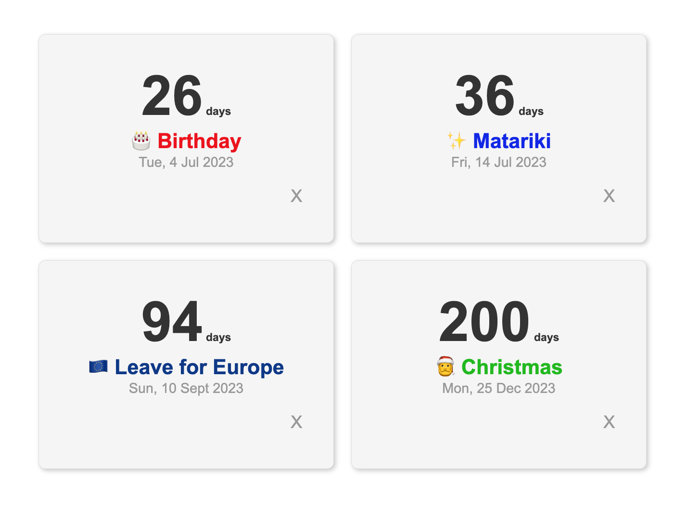

# DayWatch: New Tab Countdown Tracker

Chrome extension that shows you the days left until the date arrives. Make as many timers as you like.

Now live on the [Chrome Web Store](https://chrome.google.com/webstore/detail/daywatch-new-tab-countdow/lmaiakmjepidofmhoepdpdicoehkmeoj)

## Features

* Choose a custom color
* As many countdowns as you like

## Screenshot




## Installation

Navigate to [chrome://extensions/](chrome://extensions/) and click the "Load
unpacked extension..." button. Navigate to and select this directory.

You  should then see an "Improved new tab page" extension and see the app when you open a new tab.

## Chrome Web Store Packaging

From this `src/` directory:

### Package only

```bash
npm run package:chrome
```

Creates a versioned zip using the value in `manifest.json`, for example:

`../dist/chrome/daywatch-v1.0.0.zip`

### Verify then package (recommended)

```bash
npm run package:chrome:verify
```

This runs the test suite first (`npm run test:run`) and only creates the upload zip if tests pass.
